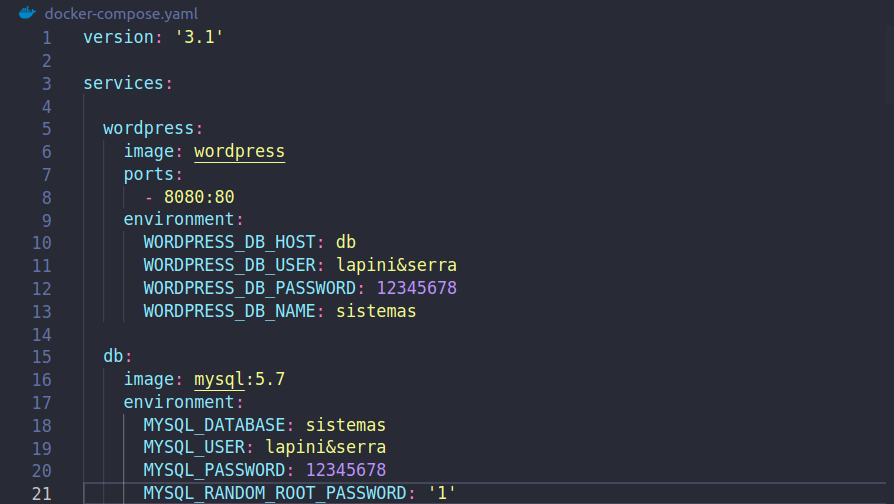
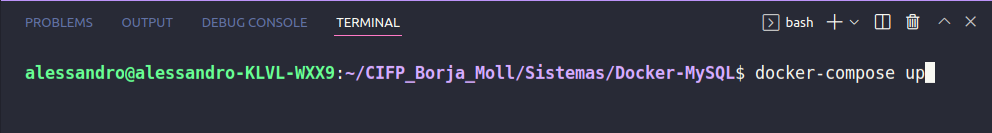
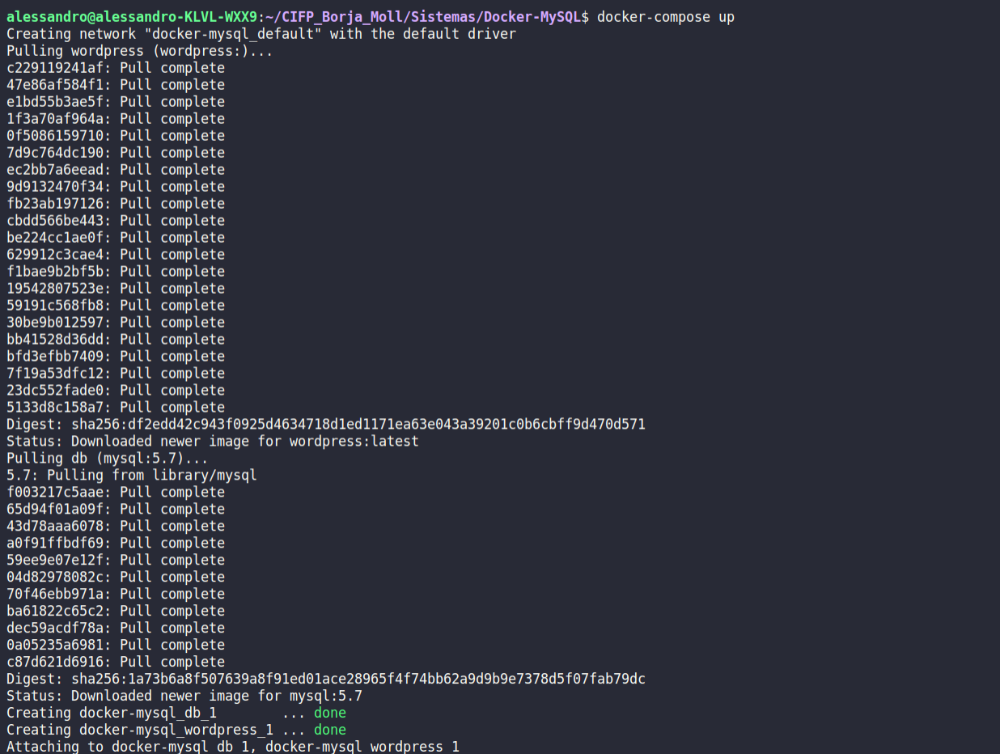
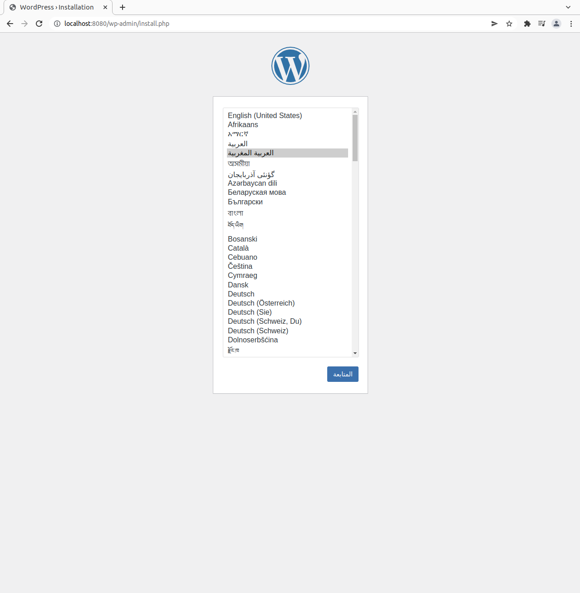

Práctica realizada por Alessandro Lapini y Josep Serra.

# Wordpress & Mysql con Docker compose

Siguiendo el videotutorial propuesto de un creador de contenido de habla hispana,que se está especializando en Docker, utilizando docker compose deberéis gestionar una configuración de wordpress y mysql. Para empezar debemos saber que con docker compose podemos manejar fácilmente las configuraciones de varios contenedores.

## Solución

### yaml
Primero de todo hay que crear el `docker-compose.yaml`

Se puede apreciar la configuracion de las dos tecnologías que usaremos, la configuracion para utilizar *Wordpress* y *MySql*.

### comando para arrancar docker-compose

Arrancamos el siguiente comando que descargará las imagenes:

### Comprobación 

